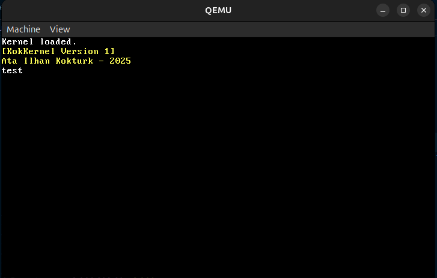

#  KokKernel

  
  

*You can read notes update by update [here](UPDATES.md)*

Basic kernel project written in C and some Assembly. Just prints message for now and can read keyboard and allocates RAM.

But since hasn't have "advanced" memory management and interruptions, after pressing each key you have to press ESC to write another letter.

---

## Requirements

- qemu or any VM
- nasm or any assembler
- gcc or any C compiler
- A linker software on Windows builds (like MSYS2) or default `ld` linker on Linux.

> [!NOTE]
> Optionally use a Linux distro like Ubuntu, because easier and already has linker in it. Windows doesn't have in-built linker, you should use MSYS2

---

## Setup

`build_i386.sh`

You can build it via [build_i386.sh](build_i386.sh) and you can pass `--fullcln` parameter for clean build and `--dist` for only **kernel.bin**.

Also you can use `clean_all.sh` to clean all the *dist* and *build* directories.

> [!IMPORTANT]
> It automatically starts it. so just be sure you added correct files on [src](src) in the `OBJS` value at the [src/Makefile](src/Makefile) and `LINKER_FILES` at the [build_i386.sh](build_i386.sh)

---

## License
This project is licensed under the [MIT License](LICENSE.txt).  
Made with 💙 by Ata İlhan Köktürk.

---

## Contribution

Feel free to open issues or contribute to the project!

---

## Contact

You can find me and my socials here: [Click here to visit my profile](https://github.com/atailh4n)

Copyright 2023-2025, Ata İlhan Köktürk